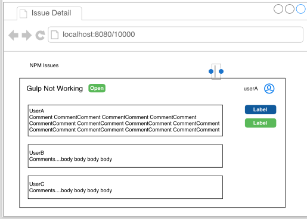

## NPM Issue Viewer App
This is a new issue viewer application created with ReactJS. The trial project for this viewer is the [npm issues from github](https://github.com/npm/npm/issues).
[Mock-up](#mock-up) is available below. 

## Run this app

### `npm install`

Install the app

### `npm start`

Runs the app in the development mode.  
Open [http://localhost:3000](http://localhost:3000) to view it in the browser.
Chrome browser is recommended.

### `npm test`
Run all tests using Jest. 

## Approach

This project was bootstrapped with [Create React App](https://github.com/facebookincubator/create-react-app).

### Scope
 
 **Default list page**
- [x] List issues per 25 page 
- [x] Navigate between pages at increment of 25
- [x] Display default page issues with number, title, user name, avatar, and 140 characters of the body
- [ ] Display labels. (If I have more time, I will create a component LabelList which will store Label components.
                       Then, render the LabelList component inside the IssueItem.)
                       
 **Issue details page**
- [x] Click on an individual issue from default page will take you to a detail page
- [x] Style individual issue page with title, state, user name, avatar, and summary
- [x] Fetch comments and display comments if any
- [x] Names with @-notation in the issue should link to the user's GitHub page

 **Test and Styling**
- [x] Unit tests are written with Jest. 
      (First time working with Jest. If there is more time, I will write more tests such as checking if endpoints have the valid responses, 
      navigation, and check if error messages have been handled correctly.)
- [x] Show off my styles
      
### Mock-up
- Draw and identify reusable React components in the mock-up.
For example: Home, IssueList, IssueItem, Details, DetailItem, CommentList, and CommentItem

 
 

### Structure
- `components/Home`: consists of components related to a list of issues and separate components with stateless and stateful.  
- `components/Details`: consists of components related to Details page
- `components/Common`: consists of utility functions
- `api/github`: consists of github issues endpoints

### Packages used
- `htmlToText`: convert from html to text
- `lodash`: truncate to 140 characters
- `Marked`: convert from github markup to html markup

### Styling
- I wrote the majority of styles with inline styles
- Used `Panel` for displaying comment and `Pagination` from `React-Bootstrap`

Thank you. If you have any questions, please feel free to email me at lzhang800@gmail.com

## What the app looks like

### Npm issues default page

### Npm detail page

